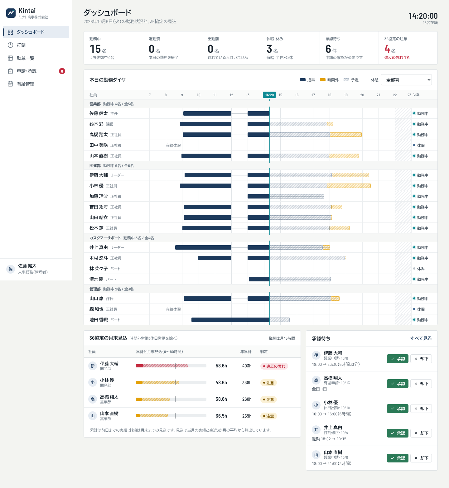

# Kintai（仮名）

中小企業向けの勤怠管理 SaaS。CYBER XEED など既存製品を調査し（[docs/competitor-research.md](docs/competitor-research.md)）、
低価格・初期費用なし・36協定の上限チェックを軸にした代替を目指しています。
**製品名は仮名**です。`src/brand.ts` の1か所を書き換えると、画面・メール・公開サイト・規約がすべて追従します。



## できること

**契約者（会社）向け**
- 会社登録（企業ID）と30日間の無料トライアル（カード不要）
- 社員管理: 追加・編集・退職・復職、CSV一括取り込み（Excel の Shift_JIS も可）、一時パスワードの発行・再発行
- 会社設定: 特別条項の有無、36協定の起算月、会社の休日、国民の祝日（内閣府の公式データ）
- 請求: Stripe で申し込み、在籍人数に応じた月額（既定 1人300円・税抜）、支払い方法・請求書の管理
- 全データの書き出し（JSON）

**勤怠**
- 打刻（出勤・退勤・休憩。時刻はサーバーが記録）
- ダッシュボード: 全社員の本日の勤務を運行ダイヤのように一覧、36協定の月末見込、承認待ち
- 勤怠一覧・個人明細（月次、CSV出力）: 日8時間／週40時間超、深夜、法定休日、打刻漏れの検出
- 36協定チェック: 月45時間・年360時間、特別条項（年720時間・年6回）、単月100時間未満、2〜6か月平均80時間
- 申請・承認: 残業・休日出勤・有給・打刻修正。承認で有給の取得日・打刻の訂正が反映される
- 有給管理: 付与日数（通常・比例）、残日数、年5日の取得義務

## 構成

| パス | 内容 |
|---|---|
| `src/engine` | 労働時間の計算エンジン。DB・UI非依存の純関数 |
| `src/domain` | 打刻データから月次・36協定リスク・本日の状況・有給を組み立てる集計層（サーバーと画面で型を共有） |
| `src/server` | API サーバー（Hono + SQLite）。会社ごとにDBファイルを分離、認証、課金、メール、運用CLI |
| `src/app` | 管理画面・打刻画面（React + Vite）。`/app/` に配信 |
| `site/` | 公開サイト（LP・利用規約・プライバシーポリシー・特商法表記）。`/` に配信。**規約はひな形で、公開前に弁護士の確認が必要** |
| `deploy/` `Dockerfile` `docker-compose.yml` | デプロイ資材（Caddy で HTTPS） |
| `docs/operations.md` | **公開前のチェックリスト・Stripe 設定・バックアップ・解約対応・セキュリティの現状** |

## 開発

Node.js 22.13 以上が必要です（SQLite は組み込みの `node:sqlite` を使います）。

```bash
npm install
SEED_PASSWORD='8文字以上' npm run db:seed   # デモ会社（企業ID: demo）を data/ に作る。本番では実行不可

npm run dev:server    # API  http://127.0.0.1:8787
npm run dev           # 画面 http://localhost:5173/app/（公開サイトは /app/site/index.html）
```

デモのログイン: 企業ID `demo` / 管理者 `e16` / 一般社員 `e01`〜`e18`。社員・勤務実績はすべて生成したサンプルです。
開発中はメールは送信されず、サーバーのログに内容が出ます。課金は、Stripe の設定がなければ無効です。

```bash
npm test              # 156 テスト（エンジン・集計層・API・課金・運用ツール）
npm run typecheck
npm run build         # 型チェック + 画面・公開サイト + サーバー（dist-server）
npm start             # 本番相当（dist-server を Node で起動）
npm run ops -- list   # 運用コマンド（backup / export / delete など。docs/operations.md）
```

### 環境変数

| 変数 | 内容 |
|---|---|
| `APP_URL` | 公開URL（末尾スラッシュなし）。メール内リンク・決済後の戻り先に使う。未設定ならメールは送られない |
| `DATA_DIR` | データの置き場所（既定 `data`）。`control.db` と `tenants/` が入る |
| `PORT` / `HOST` | 待ち受け（既定 `8787` / `127.0.0.1`） |
| `SECURE_COOKIE=1` | HTTPS で運用するとき必須 |
| `TRUST_PROXY=1` | リバースプロキシの背後で `X-Forwarded-For` を信頼する |
| `SMTP_URL` / `MAIL_FROM` | メール送信 |
| `STRIPE_SECRET_KEY` `STRIPE_WEBHOOK_SECRET` `STRIPE_PRICE_ID` | 4つ（`APP_URL` 含む）すべて設定すると課金が有効 |
| `STRIPE_AUTOMATIC_TAX=1` | Stripe Tax で消費税を自動計算 |

## 現状の制約（正直に）

- **Stripe 本体との実接続は未検証**です。Webhook は SDK の署名機能で検証済みですが、Checkout・ポータル・数量更新は、テストモードで通してください（[運用ガイド](docs/operations.md)）
- Docker イメージのビルドは未検証です（アプリ本体のビルドと `node dist-server/index.js` での起動は確認済み）
- **夜勤など日をまたぐ勤務、変形労働時間制・フレックスの精算期間、端数処理、ICカード・GPS打刻、シフト管理、給与ソフト連携は未対応**
- 単一サーバー前提（SQLite）。ログイン失敗回数・各種の試行制限はメモリ保持で、複数台では共有されない
- 二要素認証・SSO・監査ログの閲覧画面は未実装
- 労働基準法に関する数値（付与日数表、36協定上限など）は、実運用前に社会保険労務士による確認が必要
- 祝日データは内閣府の公表分（2027年まで）。年1回の更新が必要（`node scripts/update-holidays.mjs`）
- 公開サイトの規約類は**ひな形**。運営者情報・委託先・返金方針などの空欄を埋め、弁護士の確認を受けてから公開すること
